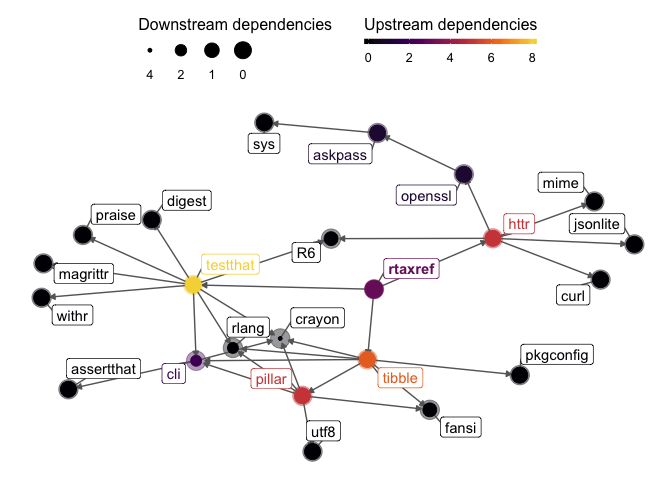

<!-- README.md is generated from README.Rmd. Please edit that file -->

# rtaxref – an R client to the French Taxonomical Reference

[](https://www.repostatus.org/#active)
[](https://travis-ci.org/Rekyt/rtaxref)
[](https://codecov.io/gh/Rekyt/rtaxref)

The goal of rtaxref is to provide an R client to TaxRef API, the French
Taxonomical Reference and associated database on species. The API
provides nomenclature, taxonomy, biogeographic repartition, statuses and
interactions of species. See the API documentation
[here](https://taxref.mnhn.fr/taxref-web/api/doc).

## Installation

`rtaxref` is not yet on CRAN. However, you can install the development
version of `rtaxref` from GitHub with:

``` r
# install.packages("remotes")
remotes::install_github("Rekyt/rtaxref")
```

## Usage

`rtaxref` contains functions to retrieve data from TaxRef-Hub. The
access data is released under the [Creative Commons
Attribution-ShareAlike 3.0 (CC BY-SA 30)
license](https://creativecommons.org/licenses/by-sa/3.0/). A suggestion
of citation is included in `rtaxref` via `citation("rtaxref")`.

To avoid collisions with other packages all `rtaxref` functions are
prefixed with `rt_*()`, for example `rt_taxa_id()` lets you access to
the information about a taxon using its unique id (also called `cdNom`
in TaxRef):

``` r
rtaxref::rt_taxa_id(id = 101027)
#> # A tibble: 1 x 45
#>       id referenceId parentId scientificName authority fullName
#>    <int>       <int>    <int> <fct>          <fct>     <fct>   
#> 1 101027      101027   193133 Helianthus an… L., 1753  Heliant…
#> # … with 39 more variables: fullNameHtml <fct>, rankId <fct>,
#> #   rankName <lgl>, referenceName <fct>, referenceNameHtml <fct>,
#> #   frenchVernacularName <fct>, englishVernacularName <fct>,
#> #   genusName <fct>, familyName <fct>, orderName <fct>, className <fct>,
#> #   phylumName <lgl>, kingdomName <fct>, vernacularGenusName <lgl>,
#> #   vernacularFamilyName <lgl>, vernacularOrderName <lgl>,
#> #   vernacularClassName <fct>, vernacularPhylumName <lgl>,
#> #   vernacularKingdomName <fct>, vernacularGroup1 <lgl>,
#> #   vernacularGroup2 <lgl>, habitat <fct>, fr <fct>, gf <lgl>, mar <fct>,
#> #   gua <fct>, sm <fct>, sb <fct>, spm <fct>, may <fct>, epa <lgl>,
#> #   reu <fct>, sa <lgl>, ta <lgl>, nc <fct>, wf <lgl>, pf <fct>,
#> #   cli <lgl>, taxrefVersion <fct>
```

You get information about the taxon related to taxonomy, the referance
name, vernacular names as well as distribution information.

`rt_taxa_search()` let’s you search a taxon with different criteria:

``` r
rtaxref::rt_taxa_search(sciname = "Helianthus annuus")
#> # A tibble: 9 x 61
#>       id referenceId parentId scientificName authority fullName
#>    <int>       <int>    <int> <chr>          <chr>     <chr>   
#> 1 101027      101027   193133 Helianthus an… L., 1753  Heliant…
#> 2 135249      101027       NA Helianthus an… L., 1753  Heliant…
#> 3 773544      101027       NA Helianthus an… (Heiser)… Heliant…
#> 4 773545      101027       NA Helianthus an… (Douglas… Heliant…
#> 5 773546      101027       NA Helianthus an… Heiser, … Heliant…
#> 6 772409      101027       NA Helianthus an… (Douglas… Heliant…
#> 7 613531      613531   101027 Helianthus an… L., 1753  Heliant…
#> 8 613530      613530   101027 Helianthus an… (DC.) Co… Heliant…
#> 9 621487      613530       NA Helianthus an… Thell.    Heliant…
#> # … with 55 more variables: fullNameHtml <chr>, rankId <chr>,
#> #   rankName <lgl>, referenceName <chr>, referenceNameHtml <chr>,
#> #   frenchVernacularName <chr>, englishVernacularName <chr>,
#> #   genusName <chr>, familyName <chr>, orderName <chr>, className <chr>,
#> #   phylumName <lgl>, kingdomName <chr>, vernacularGenusName <lgl>,
#> #   vernacularFamilyName <lgl>, vernacularOrderName <lgl>,
#> #   vernacularClassName <chr>, vernacularPhylumName <lgl>,
#> #   vernacularKingdomName <chr>, vernacularGroup1 <lgl>,
#> #   vernacularGroup2 <lgl>, habitat <chr>, fr <chr>, gf <lgl>, mar <chr>,
#> #   gua <chr>, sm <chr>, sb <chr>, spm <chr>, may <chr>, epa <lgl>,
#> #   reu <chr>, sa <lgl>, ta <lgl>, nc <chr>, wf <lgl>, pf <chr>,
#> #   cli <lgl>, taxrefVersion <chr>, self.href <chr>, reference.href <chr>,
#> #   parent.href <chr>, classification.href <chr>, synonyms.href <chr>,
#> #   children.href <chr>, vernacularNames.href <chr>, media.href <chr>,
#> #   status.href <chr>, interactions.href <chr>, taxrefHistory.href <chr>,
#> #   externalIds.href <chr>, taxonomicRank.href <chr>, habitat.href <chr>,
#> #   taxrefUri.href <chr>, inpnWebpage.href <chr>
```

You a full list of functions included in `rtaxref` by going to the
[`rtaxref`
website](https://rekyt.github.io/rtaxref).

## Dependency network (Imports only)


## Dependency network (Imports and Suggests)



## Code of Conduct

Please note that the ‘rtaxref’ project is released with a [Contributor
Code of Conduct](CODE_OF_CONDUCT.md). By contributing to this project,
you agree to abide by its terms.

## Related projects

Other packages lets you work with taxonomical information from relevant
databases:

  - [`taxize`](https://github.com/ropensci/taxize) let’s you work with
    many databases as well as clean a list of taxon names,
  - [`ritis`](https://github.com/ropensci/ritis) a client for another
    taxonomic database,
  - [`taxa`](https://github.com/ropensci/taxa) a package that proposes a
    reference class for taxonomic information (maybe used by `rtaxref`
    in the future),
  - [CRAN taxonomy Task View](https://github.com/ropensci/taxonomy)
    references many related packages that are used to work with
    taxonomic information.
